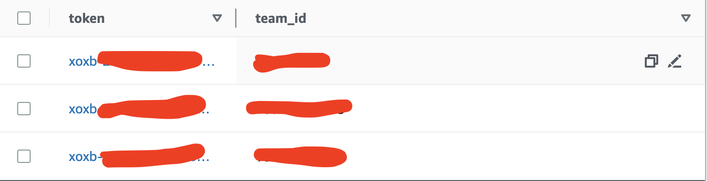

  
  <h6 align="center">Image from the movie <i>Kiki's Delivery Service</i></h6>
  <h1 align="center">Kiki Slack App</h1>  

A scalable slack bot hosted on AWS that can send messages to multiple channels at once! More functionality coming soon!     

## Usage
Send a message to any number of Slack channels with the `/ki-send` command.
Syntax: `/ki-send #channel-n Hello there!`
Any number of space-seperated channel ID's can be used (replace `#channel-n`)

## Notes on the Current Version
- There is no error handling in place for now, but this could easily be added. For example, if a user enters the `/ki-send` command with an empty message to a specified channel, the default message that channel will receive will look something like this: `#C05F37H8V55|second-test-workspace>` this is nothing important and is just the Slack id of that channel. If no channel is specified at all within the command, nothing will happen.
- I recommend installing it within a separate workspace first if you wanted to test it out beforehand, but please note that if you repeat the process of installing the app and then uninstalling it again and again while testing it out, it will cause an error (something like “dispatch failed”). The reasons are not a big deal and can be easily fixed, so just let me know if that happens (I don’t think you’ll be installing/uninstalling over and over though..).
- A rough estimate of improved efficiency for sending 15 messages individually to say 10 (I chose 10 at random) channels decreases from 150 individual messages to just 15 :)

## Summary of Development & Challenges 
This is the first Slack bot/app that I have created and was also my first time working with Amazon Web Services. I'ved worked with Microsoft's Azure cloud service in the past, but ran out of free credits so ended up going with the AWS free tier! I originally started developing Kiki using the Slack Bolt (with JavaScript) and [Serverless](https://www.serverless.com/) frameworks. I learned a lot from working with both tools! Using the Serverless CLI to host and deploy my app started out well! 

It wasn't until I started setting up the my redirect links, event subscription URLs, and handling the [OAuth 2.0](https://api.slack.com/legacy/oauth) process that I ran into some issues. I ended up starting over and using Python instead. From here, I created AWS lambda functions, each with an API Gateway trigger, for the event subscription request URL, slash commands, and the requried OAuth redirect URL needed for distribution. The third one was the trickiest. 

I also ran into an `operation_timeout` issue when trying to use my slash command with more than 3 channels. This is because the Slack API expects a response after 3 seconds. Squishing all of my code within one Lambda function caused it to take >3 seconds. To fix this, I broke my code up into receiver and worker functions. The former acknowledges the Slash command event and sends the appropriate response. It also sends the event payload to another Lambda function that handles all of the command's logic! I may change my current fix to use AWS SNS instead to help make my code more scalable and asynchronous.

I had to create a DynamoDB table to store Slack workspace ID's for each user that installed the app. These ID's were saved and retrieved within my OAuth lambda function. 

</img>

This was my first time working with AWS DynamoDB, so it took quite some time to research and learn how to use (primary keys and sort keys can be a big issue when `get_item()`). I ended up using the `scan()` function to access my DynamoDB table, but will change this in future to improve runtime (scan is not the best way to access items, as it will look at everything within the table). On a more positive note, I fell in love with the AWS Cloudwatch logs! They helped me debug all of my lambda functions!

All in all, this project was really fun and I'm happy that it will be used by colleagues to help improve productivity. It can be easily added to and modified if needed. Check out the [Slack API](https://api.slack.com/legacy/oauth) if you want to get started on your own bot/app!
